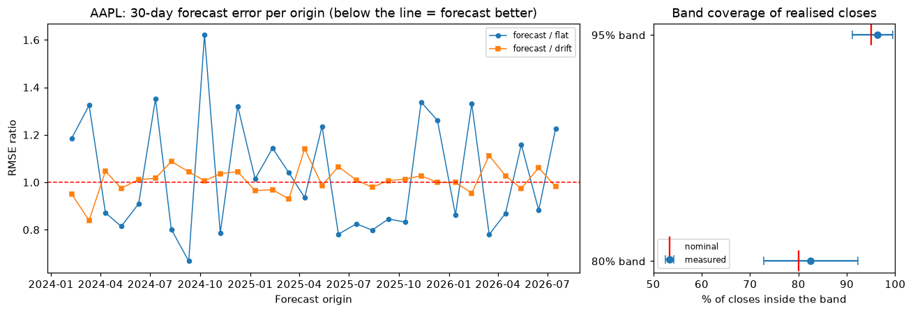

# AAPL next-day price prediction with an LSTM, evaluated honestly

> **Educational project, not financial advice.** Nothing here is a trading signal, and past performance of any
> model says little about future prices.

Daily stock prices are close to a random walk, so the useful question is not "does the LSTM's line look like the
price?" (any lagged copy of the price does) but **"does it predict the next close better than *tomorrow = today*?"**
This project trains a small LSTM on Apple (AAPL) history and measures it against that baseline, moving averages and
ARIMA, using walk-forward validation and confidence intervals.

## Quick start

1. Get a free [Tiingo API key](https://www.tiingo.com/account/api/token) and provide it as `TIINGO_API_KEY`:
   an environment variable, a line in a git-ignored `.env` file (copy `.env.example`), or a Colab secret of
   that name. The environment variable wins if both are set. Never paste the key into a notebook cell or commit it.
   In a Claude Code cloud environment you can instead add an **API credential** for `api.tiingo.com` with the header
   `Authorization: Token <key>`; the key then never enters the session, and with no local key the download is sent
   without one and authenticated on the way out.
2. Install dependencies (skip on Colab, where they are preinstalled): `pip install -r requirements.txt`
3. Open `notebooks/Apple_Stock_Prediction.ipynb` and run all cells. The first run downloads prices into `data/`;
   later runs read that file and need no key or network.

`STOCK_LSTM_QUICK=1` runs a tiny model on 2 folds for a fast smoke test. The full run trains 15 small networks for
the evaluation plus 3 for the forecast (CPU is fine; expect several minutes).

The notebook is committed **without outputs**: every table, plot and verdict is generated when you run it, and it is
the source of truth. The [results snapshot](#results-snapshot) below is a dated copy of one run, rendered from
`docs/results.json` (run the notebook with `STOCK_LSTM_SAVE_RESULTS=1` to regenerate the JSON, the figures and that
section together).

## Method

| Step | What is done | Why |
|---|---|---|
| Data | Tiingo daily bars, `adjClose` (split- and dividend-adjusted), fixed `[START, END]` range, cached to `data/` | Raw `close` contains AAPL's 2020-08-31 4:1 split as a fake ~75% crash. Loading refuses any series with such a jump. |
| Target | Next-day **log return**, converted back to a dollar price | Returns are roughly stationary; price levels trend out of the range a scaler saw in training. |
| Model | 2-layer LSTM (32 units each), 60-day window, Adam, MSE | Small on purpose: ~2,000 samples per fold. |
| Leakage control | Scaler and weights use only data before each fold's test block; a separate validation slice drives early stopping | The test days never influence training, scaling or when to stop. |
| Evaluation | Expanding-window **walk-forward**, 5 folds x ~6 months, 3 seeds per fold (mean = "LSTM"), all models scored on the same days | Covers several regimes instead of one split; shows run-to-run noise. |
| Baselines | Persistence, **drift** (persistence + average past return), MA(5), MA(20), ARIMA(1,1,1) | An LSTM claims skill only relative to these. Drift matters because stocks rise on average: a model that only learned that would look skilful in a rising market. |
| Metrics | RMSE, MAE, MAPE, directional accuracy, all in **dollars**; RMSE ratio vs persistence with a 95% block-bootstrap interval | A ratio below 1 whose interval contains 1 is not evidence of skill. Direction is compared with the up-day base rate. |
| Forecast | 30 trading days as a **fan of simulated paths**: each step adds a resampled out-of-sample residual before feeding the return back | One recursive line overstates precision; errors compound. |
| Backtest | The live forecast is scored against the closes that actually followed the origin, vs "flat" and vs drift. A **rolling-origin backtest** then repeats a 30-day forecast from ~28 origins across the test days (each using its own fold's model and only information available then) and reports RMSE ratios, win rates and band coverage with block-bootstrap intervals | One path illustrates but proves nothing; many origins give an interval and a check on whether the 80% / 95% bands are calibrated. |

## Results snapshot

<!-- results:start -->

> One dated run, not a guarantee. This section is rendered from [`docs/results.json`](docs/results.json) by `python -m stock_lstm.report`, so no number in it is typed by hand; run the notebook with `STOCK_LSTM_SAVE_RESULTS=1` to regenerate it. The data provider rewrites adjusted history whenever a dividend is paid, and seeds or hardware differ, so a later run will differ slightly.

**Setup (run on 2026-09-29):** AAPL adjusted daily closes, 2015-01-02 to 2026-09-28. Models saw only data up to 2026-08-14 (2,921 trading days); the 30 later days were held out to score the live forecast. One-step evaluation: 5 walk-forward folds x 126 days = **630 out-of-sample days** (2024-02-09 to 2026-08-14), 3 seeds, 60-day window, LSTM 32 x 32 units. The data step matters: raw `close` contains the 4:1 split as a fake crash, `adjClose` does not.


**Next-day accuracy** (dollars; every model scored on the same 630 days):

| Model | RMSE | MAE | RMSE vs persistence (95% interval) | Direction correct |
|---|---|---|---|---|
| Persistence ("tomorrow = today") | $4.072 | $2.771 | 1.000 | n/a |
| Drift (persistence + average past return) | $4.070 | $2.758 | 0.999 (0.995 to 1.004) | 54.7% |
| LSTM (3-seed mean) | $4.074 | $2.762 | 1.000 (0.997 to 1.004) | 54.4% |
| ARIMA(1,1,1) | $4.097 | $2.792 | 1.006 (1.000 to 1.012) | 47.2% |
| MA(5) | $6.369 | $4.631 | 1.564 (1.466 to 1.667) | 48.8% |
| MA(20) | $10.513 | $8.481 | 2.581 (2.267 to 2.934) | 47.1% |

54.7% of these days closed up, so always guessing "up" would score 54.7% on direction.


**Reading it.** The LSTM is statistically indistinguishable from "tomorrow = today" (RMSE ratio 1.000, 95% interval 0.997 to 1.004). Its RMSE is $4.074, against $4.070 for drift and $4.072 for persistence; Drift has the lowest RMSE of the models compared (by a margin within noise). In every fold the LSTM's RMSE is within $0.011 of persistence's, and individual seeds differ by $0.002. On this data the LSTM shows no measurable edge over the naive baseline. This is a finding about this setup (a univariate LSTM on past returns, one asset, this period). The test suite's positive control shows the same evaluation does detect skill when it exists, so a null result is a result, not a tooling failure; it is not proof that no model could work.

**Live 30-day forecast vs what happened.** From the $305.93 adjusted close on 2026-08-14 the forecast reached $311.66 on day 30 (+1.9%, 80% band $278 to $350); the stock actually closed at $338.40 (+10.6%).


Over those 30 days the forecast's RMSE was $18.43, against $21.40 for "flat at the last close" and $16.74 for constant drift at the average past return (+2.6% over the horizon). It beat "flat" but not drift, so its advantage over "flat" is drift, not skill. Its bands covered 97% (80% band) and 100% (95% band) of the realised closes; on one strongly autocorrelated path that says little about calibration, which is what the rolling-origin backtest below is for.

**Rolling-origin backtest.** 30 forecasts of 30 days, one every 21 trading days from 2024-02-08 to 2026-07-16, each made by the model of its own fold (trained before the days it forecasts) using only information available at its origin, and scored on what actually followed:

| | RMSE | vs flat (95% interval) | vs drift (95% interval) |
|---|---|---|---|
| Model forecast | $13.80 | 0.975 (0.902 to 1.035) | 1.005 (0.994 to 1.019) |
| Constant drift | $13.73 | 0.970 (0.891 to 1.034) | 1.000 |
| Flat at last close | $14.16 | 1.000 | 1.031 (0.967 to 1.123) |

The model forecast's RMSE is 0.975x "flat" (0.902 to 1.035): statistically indistinguishable from "flat"; and 1.005x drift (0.994 to 1.019): statistically indistinguishable from drift. It had the lower error on 53% of origins against "flat" and 43% against drift. The 80% band contained 83% of realised closes (95% interval 73 to 92) and the 95% band 96% (91 to 100): both bands covered about as often as intended. Windows overlap, so intervals are block bootstraps over origins, not over days.



<!-- results:end -->

## Repository layout

```
notebooks/Apple_Stock_Prediction.ipynb   the analysis (run this)
docs/                                    results.json and the README figures
stock_lstm/
  data.py         Tiingo download, cache, validation (rejects unadjusted splits)
  features.py     log returns, train-only scaler, leak-free windowing
  model.py        LSTM + FittedModel (owns its scaler; only raw returns in/out)
  baselines.py    persistence, moving average, ARIMA
  metrics.py      dollar-space metrics, bootstrap CI for RMSE ratios
  evaluate.py     score several models on identical days
  walkforward.py  fold layout and the evaluation loop
  forecast.py     path simulation and backtest scoring
  rolling.py      rolling-origin backtest of the multi-day forecast
  report.py       results.json and the README results section
  plots.py        labelled figures
tests/            pytest suite (see below)
```

## Tests

```bash
pip install -r requirements-dev.txt
pytest -m "not slow"     # fast unit tests
pytest                   # also trains small networks and runs the notebook end to end
```

Besides unit tests, the suite checks the pipeline itself:

* **Causality:** tampering with prices from day *d* onward must not change any prediction made for days up to *d*.
* **Negative control:** on a synthetic random walk the LSTM must look no better than persistence.
* **Positive control:** on synthetic returns with real autocorrelation it must beat persistence, with an interval
  below 1. Together these show the evaluation can tell "no skill" from "skill".
* **Rolling-origin honesty:** each forecast uses only its own fold's model and information available at its origin (tampering with later prices changes nothing it produced, including band width), and the bands cover ~80% / ~95% when the noise model is right.
* **Regression tests** for the bugs in the first version (see below), verified to fail when the bug is reintroduced.
* A hygiene test that fails on committed credentials or committed notebook outputs.

## Limitations

* One asset, one market regime, one historical path. Nothing here says how the model would do elsewhere or later.
* Adjusted history is rewritten by the provider whenever a dividend or split is paid, so re-downloading later can
  change old values slightly. Keep your cached CSV if you need exact reproducibility. Check Tiingo's terms before
  committing raw data (`data/` is git-ignored by default).
* Predicting tomorrow's move from past prices alone is a very low signal-to-noise problem. If the notebook reports
  an interval containing 1.0, that is the expected outcome, not a bug.
* Univariate, no transaction costs, slippage or position sizing: a forecasting exercise, not a trading strategy.
* The results snapshot is one run of one configuration. Its figures plot Tiingo-derived prices; check Tiingo's terms
  if you redistribute them, and remove `docs/images/` if they do not allow it.

## What changed from the first version

The first version (still in git history) had problems, all fixed here:

* **Reported RMSE was invalid.** Targets were still scaled to [0, 1] while predictions were converted to dollars, so
  even a perfect model would score about the average price ("213" on a ~$211 stock). The real one-step error implied
  by its own training logs was roughly $3.6 (train) and $5.2 (test). The "overfitting" conclusion built on the
  invalid numbers was unfounded.
* **Unadjusted prices.** The 2020 split appeared as a crash and fixed the scaler range at pre-split prices.
* **Forecast cell:** hard-coded `test_data[341:]` gave 98 inputs instead of 100 (padded with zeros), the output was
  never converted to dollars or plotted, and it was never scored.
* **No baseline,** scaler fit on all data, test set used as validation, single unseeded run.
* **README did not match the code** (different data source, date range, window, split, architecture and epochs).

## License

MIT, see [LICENSE](LICENSE).
