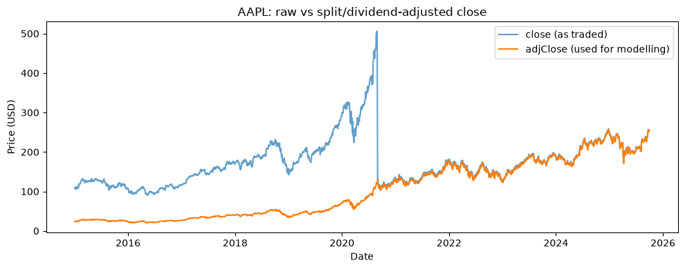
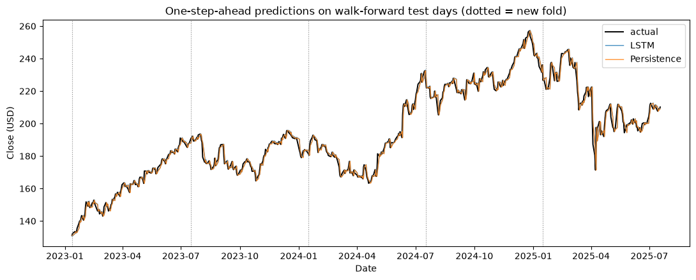
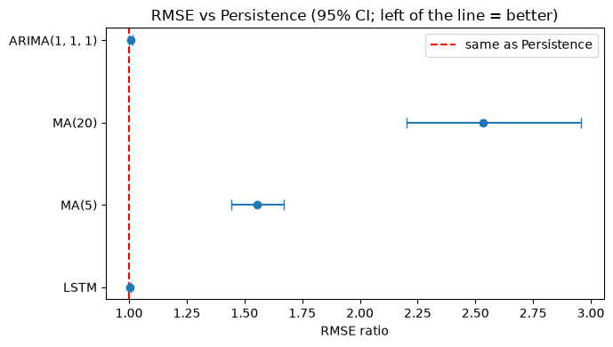
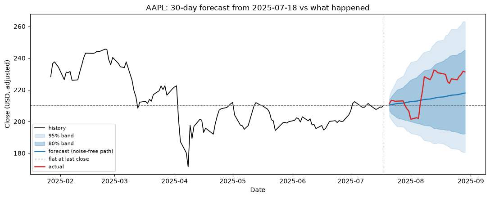

# AAPL next-day price prediction with an LSTM, evaluated honestly

> **Educational project, not financial advice.** Nothing here is a trading signal, and past performance of any
> model says little about future prices.

Daily stock prices are close to a random walk, so the useful question is not "does the LSTM's line look like the
price?" (any lagged copy of the price does) but **"does it predict the next close better than *tomorrow = today*?"**
This project trains a small LSTM on Apple (AAPL) history and measures it against that baseline, moving averages and
ARIMA, using walk-forward validation and confidence intervals.

## Quick start

1. Get a free [Tiingo API key](https://www.tiingo.com/account/api/token) and provide it as `TIINGO_API_KEY`:
   an environment variable, a line in a git-ignored `.env` file (copy `.env.example`), or a Colab secret of
   that name. The environment variable wins if both are set. Never paste the key into a notebook cell or commit it.
   In a Claude Code cloud environment you can instead add an **API credential** for `api.tiingo.com` with the header
   `Authorization: Token <key>`; the key then never enters the session, and with no local key the download is sent
   without one and authenticated on the way out.
2. Install dependencies (skip on Colab, where they are preinstalled): `pip install -r requirements.txt`
3. Open `notebooks/Apple_Stock_Prediction.ipynb` and run all cells. The first run downloads prices into `data/`;
   later runs read that file and need no key or network.

`STOCK_LSTM_QUICK=1` runs a tiny model on 2 folds for a fast smoke test. The full run trains 15 small networks for
the evaluation plus 3 for the forecast (CPU is fine; expect several minutes).

The notebook is committed **without outputs**: every table, plot and verdict is generated when you run it, and it is
the source of truth. The [results snapshot](#results-snapshot) below is a dated copy of one run.

## Method

| Step | What is done | Why |
|---|---|---|
| Data | Tiingo daily bars, `adjClose` (split- and dividend-adjusted), fixed `[START, END]` range, cached to `data/` | Raw `close` contains AAPL's 2020-08-31 4:1 split as a fake ~75% crash. Loading refuses any series with such a jump. |
| Target | Next-day **log return**, converted back to a dollar price | Returns are roughly stationary; price levels trend out of the range a scaler saw in training. |
| Model | 2-layer LSTM (32 units each), 60-day window, Adam, MSE | Small on purpose: ~2,000 samples per fold. |
| Leakage control | Scaler and weights use only data before each fold's test block; a separate validation slice drives early stopping | The test days never influence training, scaling or when to stop. |
| Evaluation | Expanding-window **walk-forward**, 5 folds x ~6 months, 3 seeds per fold (mean = "LSTM"), all models scored on the same days | Covers several regimes instead of one split; shows run-to-run noise. |
| Baselines | Persistence, MA(5), MA(20), ARIMA(1,1,1) | An LSTM claims skill only relative to these. |
| Metrics | RMSE, MAE, MAPE, directional accuracy, all in **dollars**; RMSE ratio vs persistence with a 95% block-bootstrap interval | A ratio below 1 whose interval contains 1 is not evidence of skill. Direction is compared with the up-day base rate. |
| Forecast | 30 trading days as a **fan of simulated paths**: each step adds a resampled out-of-sample residual before feeding the return back | One recursive line overstates precision; errors compound. |
| Backtest | The forecast is scored against the closes that actually followed the origin date, vs "flat at the last close", plus band coverage | A forecast that is never checked is just a picture. It is one path, so it illustrates rather than proves. |

## Results snapshot

> One dated run, not a guarantee. Re-running the notebook regenerates everything; the data provider rewrites adjusted
> history whenever a dividend is paid, and seeds or hardware differ, so a later run will differ slightly.

**Setup (run on 2026-09-28):** AAPL adjusted daily closes, 2015-01-02 to 2025-09-30. Models saw only data up to
2025-07-18 (2,651 trading days). Evaluation: 5 walk-forward folds x 126 days = **630 out-of-sample days** (about
Jan 2023 to Jul 2025), 3 seeds, 60-day window, 2 x 32-unit LSTM. The data step matters: raw `close` contains the
4:1 split as a fake crash, `adjClose` does not.



**Next-day accuracy** (dollars; every model scored on the same 630 days):

| Model | RMSE | MAE | RMSE vs persistence (95% interval) | Direction correct |
|---|---|---|---|---|
| Persistence ("tomorrow = today") | $3.217 | $2.177 | 1.000 | n/a |
| LSTM (3-seed mean) | $3.223 | $2.172 | 1.002 (0.997 to 1.007) | 53.8% |
| ARIMA(1,1,1) | $3.237 | $2.197 | 1.006 (0.999 to 1.014) | 49.4% |
| MA(5) | $5.003 | $3.611 | 1.555 (1.443 to 1.669) | 47.1% |
| MA(20) | $8.156 | $6.386 | 2.535 (2.203 to 2.959) | 47.1% |

55.3% of these days closed up, so always guessing "up" would score 55.3% on direction.





**Reading it.** The LSTM is statistically indistinguishable from "tomorrow = today" (RMSE ratio 1.002, interval 0.997
to 1.007), and its predicted line overlaps the persistence line: it behaves as a one-day-lagged copy of the price. In
every fold it lands within about $0.05 of persistence, and individual seeds differ by about $0.005. This is a finding
about this setup (a univariate LSTM on past returns, one asset, this period). The test suite's positive control shows
the same evaluation does detect skill when it exists, so "no edge" here is a result, not a tooling failure. It is not
proof that no model could work.

**30-day forecast vs what happened.** From the $210.16 adjusted close on 2025-07-18 the forecast reached $217.96 on
day 30 (+3.7%, 80% band $192 to $245); the stock actually closed at $231.28 (+10.1%).



Over those 30 days the forecast's RMSE was $10.42 against $14.19 for "flat at the last close". That is not skill: a
plain constant-drift path at the historical average return (+2.5% over 30 days) scores $11.59 (computed outside the
notebook, which does not include a drift baseline), so most of the advantage is upward drift in a rising market. Both bands covered all 30 realised closes, which on one strongly
autocorrelated path says almost nothing about calibration.

## Repository layout

```
notebooks/Apple_Stock_Prediction.ipynb   the analysis (run this)
stock_lstm/
  data.py         Tiingo download, cache, validation (rejects unadjusted splits)
  features.py     log returns, train-only scaler, leak-free windowing
  model.py        LSTM + FittedModel (owns its scaler; only raw returns in/out)
  baselines.py    persistence, moving average, ARIMA
  metrics.py      dollar-space metrics, bootstrap CI for RMSE ratios
  evaluate.py     score several models on identical days
  walkforward.py  fold layout and the evaluation loop
  forecast.py     path simulation and backtest scoring
  plots.py        labelled figures
tests/            pytest suite (see below)
```

## Tests

```bash
pip install -r requirements-dev.txt
pytest -m "not slow"     # fast unit tests
pytest                   # also trains small networks and runs the notebook end to end
```

Besides unit tests, the suite checks the pipeline itself:

* **Causality:** tampering with prices from day *d* onward must not change any prediction made for days up to *d*.
* **Negative control:** on a synthetic random walk the LSTM must look no better than persistence.
* **Positive control:** on synthetic returns with real autocorrelation it must beat persistence, with an interval
  below 1. Together these show the evaluation can tell "no skill" from "skill".
* **Regression tests** for the bugs in the first version (see below), verified to fail when the bug is reintroduced.
* A hygiene test that fails on committed credentials or committed notebook outputs.

## Limitations

* One asset, one market regime, one historical path. Nothing here says how the model would do elsewhere or later.
* Adjusted history is rewritten by the provider whenever a dividend or split is paid, so re-downloading later can
  change old values slightly. Keep your cached CSV if you need exact reproducibility. Check Tiingo's terms before
  committing raw data (`data/` is git-ignored by default).
* Predicting tomorrow's move from past prices alone is a very low signal-to-noise problem. If the notebook reports
  an interval containing 1.0, that is the expected outcome, not a bug.
* Univariate, no transaction costs, slippage or position sizing: a forecasting exercise, not a trading strategy.
* The results snapshot is one run of one configuration. Its figures plot Tiingo-derived prices; check Tiingo's terms
  if you redistribute them, and remove `docs/images/` if they do not allow it.

## What changed from the first version

The first version (still in git history) had problems, all fixed here:

* **Reported RMSE was invalid.** Targets were still scaled to [0, 1] while predictions were converted to dollars, so
  even a perfect model would score about the average price ("213" on a ~$211 stock). The real one-step error implied
  by its own training logs was roughly $3.6 (train) and $5.2 (test). The "overfitting" conclusion built on the
  invalid numbers was unfounded.
* **Unadjusted prices.** The 2020 split appeared as a crash and fixed the scaler range at pre-split prices.
* **Forecast cell:** hard-coded `test_data[341:]` gave 98 inputs instead of 100 (padded with zeros), the output was
  never converted to dollars or plotted, and it was never scored.
* **No baseline,** scaler fit on all data, test set used as validation, single unseeded run.
* **README did not match the code** (different data source, date range, window, split, architecture and epochs).

## Security note: rotate the exposed API key

The first version committed a live Tiingo API key in the notebooks' code and saved output. It has been removed from
the current files, **but it remains in this repository's git history**, which is public. Treat it as compromised:
**revoke it in your Tiingo account and create a new one.** Removing it from history (for example with
`git filter-repo`, followed by a force-push) is optional once it is revoked, and only hides it from casual browsing;
anyone who already cloned or forked the repo still has it.

## Credits

The first version followed a widely circulated Tiingo + Keras stacked-LSTM tutorial pattern; credit to that
tutorial's author for the original idea. The pipeline in this repository has since been rebuilt around the
evaluation described above.

## License

MIT, see [LICENSE](LICENSE).
